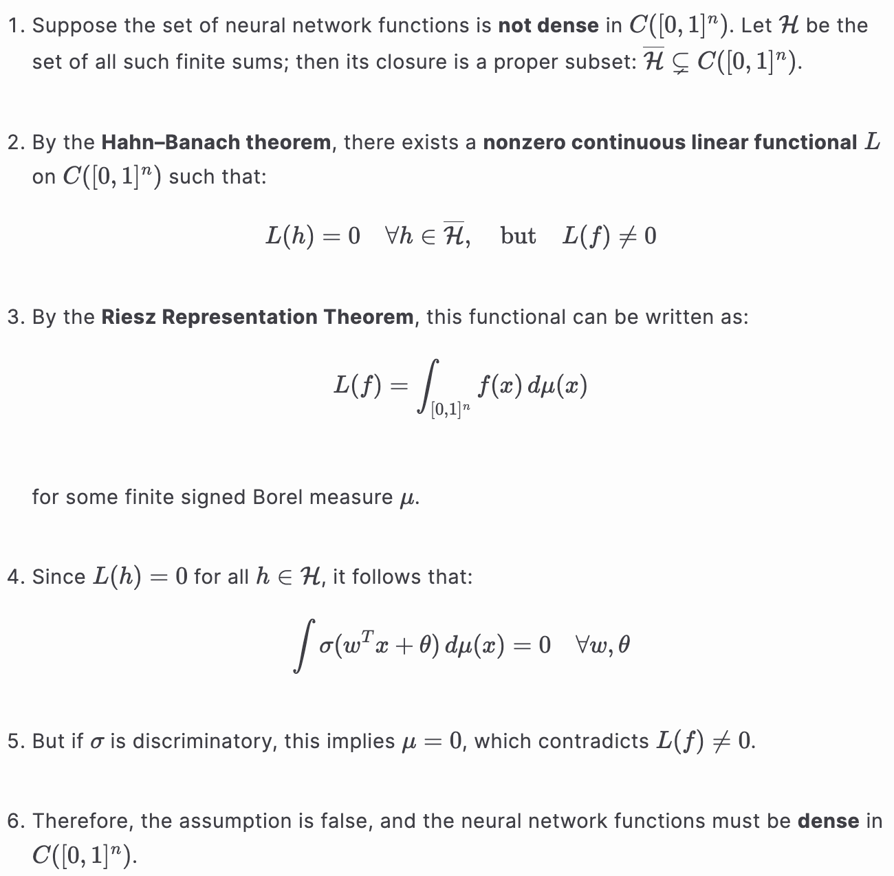

# Approximation by Superpositions of a Sigmoidal Function

- **Title:** Approximation by Superpositions of a Sigmoidal Function
- **Author:** George Cybenko 
- **Link to paper**: https://hal.science/hal-03753170/document 
- **Published in:** Mathematics of Control, Signals, and Systems (1989) 
- **Year**: 1989 

## What 

In this paper, the author proves among other things that:
- Any **continuous function** can be **uniformly approximated** by a single hidden layer feedforward neural network with a **continuous** sigmoidal nonlinearity.
- **Any decision function** can be approximated **with arbitrary precision** by a single hidden layer feedforward neural network with a sigmoidal nonlinearity. Here the decision function and the sigmoidal nonlinearity don't need to be continuous

## Why 
This paper provides rigorous mathematical foundations for why neural networks can work.

## Details

### Definitions

**Discriminatory function**  
A measurable function $\sigma: \mathbb{R} \to \mathbb{R}$ is **discriminatory** if for every finite signed Borel measure $\mu$ on $[0,1]^n$,

$$\int_{[0,1]^n} \sigma(w^T x + \theta) \, d\mu(x) = 0 \quad \forall w \in \mathbb{R}^n, \theta \in \mathbb{R}$$
implies $\mu = 0$.

**Sigmoidal function**
A measurable function $\sigma$ is *sigmoidal* if:
$$\underset{t \rightarrow +\infty}{lim} \ \sigma (t) = 1 \ and \ \underset{t \rightarrow -\infty}{lim} \ \sigma (t) = 0$$ 

### Lemma
Any continuous sigmoidal function is discriminatory

---

### Theorems

#### Main Theorem (simplified)

Let $\sigma$ be a **continuous sigmoidal discriminatory function**. Then the set of functions

$$G(x) = \sum_{j=1}^N \alpha_j \sigma(w_j^T x + \theta_j)$$

is **dense in $C([0,1]^n)$** with respect to the uniform norm.  
That is, for any continuous function $f$ and any $\varepsilon > 0$, there exists such a finite sum $G(x)$ such that:

$$\|f - G\|_\infty < \varepsilon$$

Proof

<a href="./details.md">Link to Markdown version</a>

Proceed by contradiction:

  

---

#### Application to Arbitrary Decision Functions

Even when $f$ and $\sigma$ are not continuous, one can still approximate **measurable functions** (e.g. indicator functions for classification) with **arbitrary precision in measure**.

More precisely:

Let $f: [0,1]^n \to \mathbb{R}$ be a **measurable** function, and let $\sigma: \mathbb{R} \to \mathbb{R}$ be a **measurable sigmoidal** function.  
Then for any $\varepsilon > 0$, there exists:
- A function of the form  
  $$G(x) = \sum_{j=1}^N \alpha_j \, \sigma(w_j^T x + \theta_j)$$
- And a measurable subset $D \subseteq [0,1]^n$ such that:
  $$\mu(D) \geq 1 - \varepsilon \quad \text{and} \quad |f(x) - G(x)| < \varepsilon \quad \text{for all } x \in D$$

In other words, $G$ approximates $f$ with arbitrary precision **on a set of arbitrarily large measure**.

Proof Sketch

This follows by applying <a href="https://en.wikipedia.org/wiki/Lusin%27s_theorem">Lusin’s theorem</a>, which states that any measurable function is continuous on most of the domain, and then using the main approximation theorem on that <i>continuous restriction</i>.

## References

All images are sourced from the original paper by the authors.