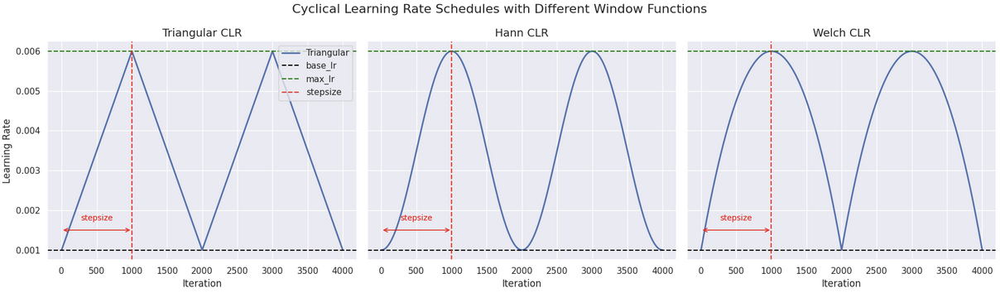
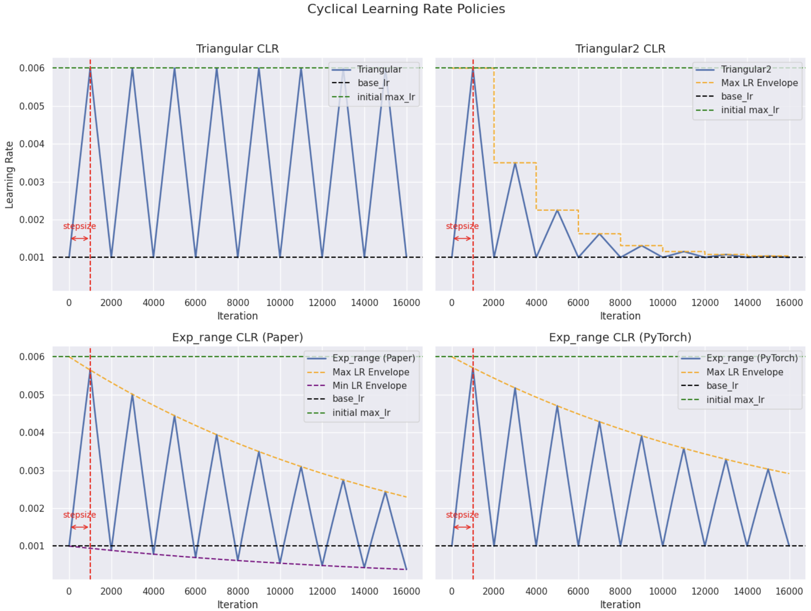
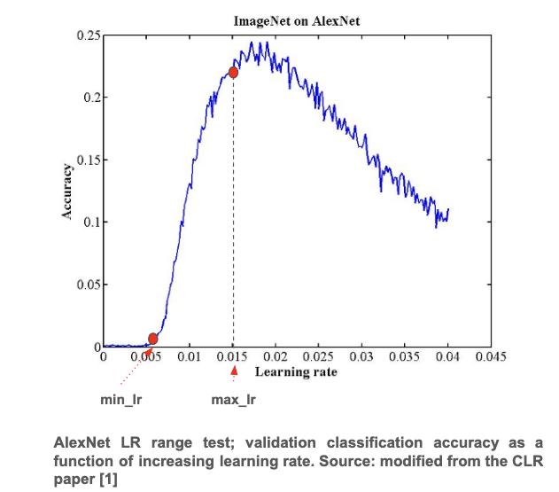

# Cyclical Learning Rates for Training Neural Networks

- **Title:** Cyclical Learning Rates for Training Neural Networks
- **Author:** Leslie N. Smith
- **Link to paper**: https://arxiv.org/pdf/1506.01186
- **Published in:** IEEE Winter Conference on Applications of Computer Vision (WACV), 2017.
- **Year**: 2017

## What

The author propose a cyclical learning rate (CLR) scheduler that varies the learning rate between two boundary values in a cyclic fashion during training. In addition, the paper introduces a method called learning rate range test, which helps automatically determine appropriate lower and upper bounds for the cycles. Experiments show that CLR and the learning rate range test results in faster convergence, improved generalization, and reduced need for extensive hyperparameter tuning.  

## Why

- Training deep neural networks requires careful tuning of the learning rate. Traditional schedules monotonically decrease it, often relying on extensive trial-and-error, which makes the process time-consuming and challenging.
- A cyclical learning rate enables the exploration of a range of learning rate values, increasing the likelihood of using effective values during different phases of training.
- Allowing the learning rate to increase during different phases of the training can help the model escape saddle points and poor local minima.
- Efficient automated methods for setting learning rates makes training neural network more pratical.

## Details

### Cyclical Learning Rate (CLR) Scheduler

In its simple form, the CLR scheduler evolves the learning rates according to a periodic function of the number of optimization steps.

The author experiments with the triangular, the Hann, and the Welch window functions, and found that they all produced equivalent results. So, they focused on the triangular window function for its simplicity.

  

- **base_lr**: minmimum learning rate
- **max_lr**: maximuim learning rate
- **stepsize**: half the cycle length

The author recommends to set **stepsize** equal to 2 - 10 times the number of iterations in an epoch.

They also explored two CLR schedules that decreases the upper boundary after each cycle:

- **triangular2**: **max_lr** is decreased so that the amplitude of the window function is halved after each cycle.
- **exp_range**: **max_lr** and **min_lr** that are decreased by an exponential factor $\gamma^{cycle\_iteration}$.

> The description in the paper indicates that for the policy `exp_range`,  it is the two boundaries **max_lr** and **min_lr** that are decreased by an exponential factor. However, according to the description of the [PyTorch implementation](https://docs.pytorch.org/docs/stable/generated/torch.optim.lr_scheduler.CyclicLR.html) and of the [implementation linked in the paper](https://github.com/bckenstler/CLR), it is only **max_lr** that is updated such that the amplitude is decreased by an exponential factor.

  

### Learning Rate Range Test

The author proposes a simple strategy to set the boundary values of CLR scheduler.

**Prcedure**:
- Train the model for a few epochs during which the learning rate is increased from a very low value to a very high value.
- Plot the evolution of the accuracy vs the learning rate.
- Note the learning rate when the accuracy starts to increase and use it as value for the minimal learning rate **min_lr**.
- Note the learning rate when the accuracy increase slow down, or becomes ragged. Use it as value for the maximal learning rate **max_lr**.

  

## Results

- Experiments were conducted on CIFAR-10, CIFAR-100, and ImageNet, using various architectures including AlexNet, GoogleNet, ResNet, and stochastic depth networks.
- CLR enables strong performance earlier in training, often reaching comparable or better results in fewer epochs compared to traditional learning rate schedules.
- When using adaptive learning rate methods (e.g., Adam or RMSProp), the benefits of CLR are sometimes diminished.
- The Learning Rate Range Test is shown to be effective for estimating:
  - the boundary learning rates needed for CLR schedules, and
  - appropriate fixed learning rates for traditional constant-rate training.
- The cyclical nature of CLR provides intuitive signals (end of cycles) for:
  - when to reduce the learning rate (typically after 3–5 cycles),
  - and when to stop training — making training more interpretable.

See the paper for the details.