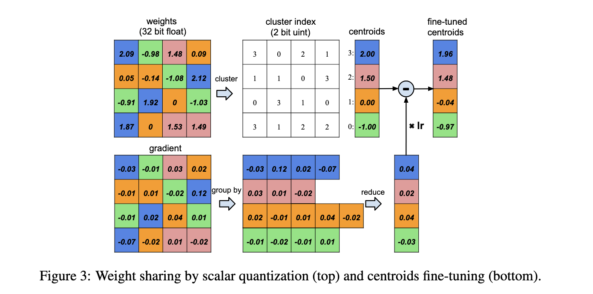
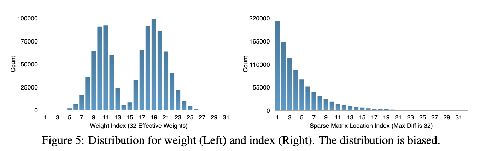
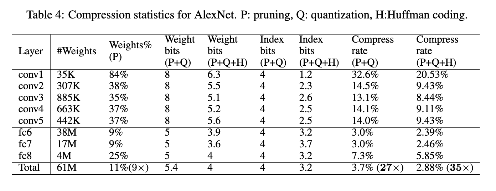
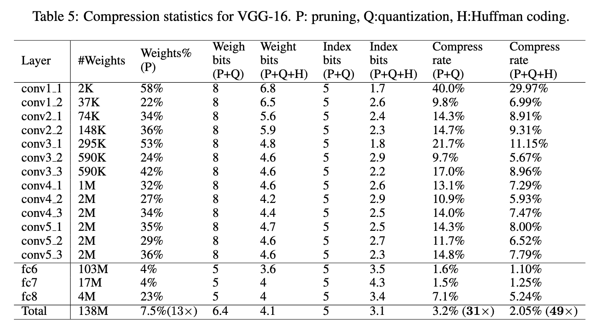
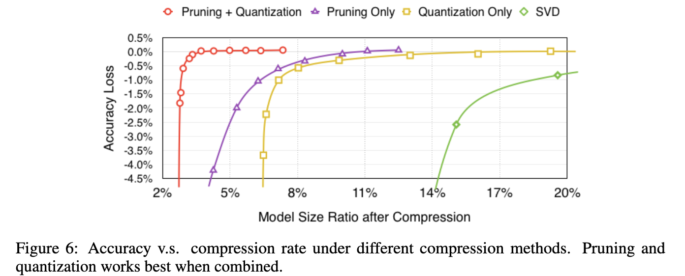
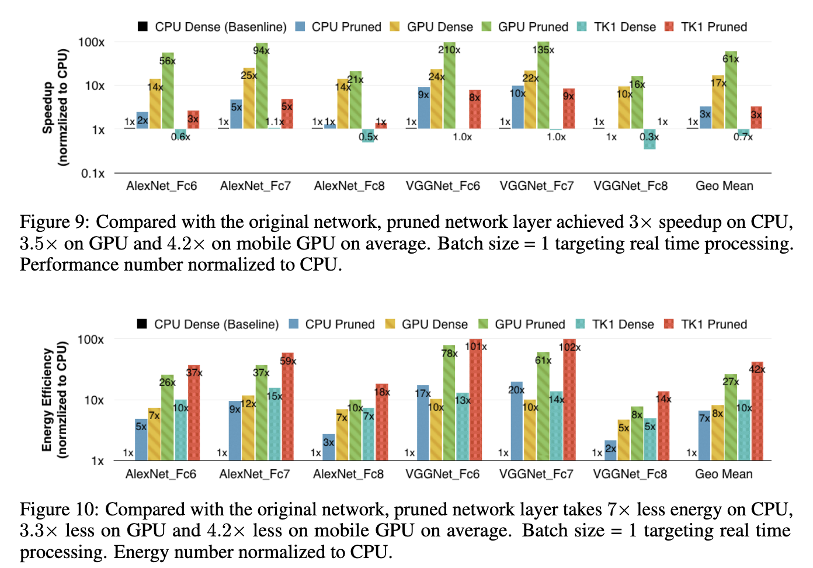
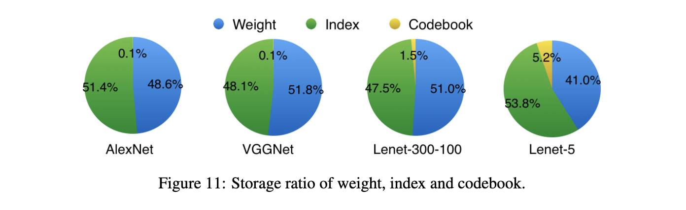

# Deep Compression: Compressing Deep Neural Networks with Pruning, Trained Quantization and Huffman Coding

- **Title:** Deep Compression: Compressing Deep Neural Networks with Pruning, Trained Quantization and Huffman Coding
- **Authors:** Song Han, Huizi Mao, William J. Dally
- **Link to paper**: https://arxiv.org/abs/1510.00149
- **Published in:** International Conference on Learning Representations (ICLR), 2016
- **Year**: 2016

## What 

The authors propose a compression pipeline for deep neural networks that significantly reduces storage requirements without sacrificing accuracy. On the ImageNet dataset, their method compresses AlexNet by 35x and VGG-16 by 49x, resulting in 3x to 4x speedup and 3x to 7x improvements in energy efficiency.

## Why
Deep neural networks are resource-intensive in terms of memory, computation, and power consumption, which restricts their deployment on resource-constrained devices such as mobile phones and IoT devices. Efficient compression enables networks to fit in on-chip storage, which reduces latency and energy consumption. For instance, accessing a 32-bit value from SRAM cache consumes about 5pJ, whereas DRAM memory access costs around 640pJ in 45nm CMOS technology.

## Details

### Method

The compression pipeline consists of three main stages:

**1 - Network pruning**
Connections with the smallest weight magnitudes in the trained network are pruned. The resulting sparse weight structures is stored in Compressed Sparse Row (CSR) format using relative indexing (i.e., index differences) to save space. Pruning alone reduces the number of parameters by 9x in AlexNet and 13x in VGG-16.

**2 - Trained Quantization and Weight Sharing**
Weights in each layer are clustered, and weights within the same cluster share a common value. For each layer, we store a table of shared weights and an index map referencing that table. To mitigate accuracy loss due to quantization, the cluster centroids are fine-tuned. During fine-tuning, gradients corresponding to each centroid are aggregated, scaled by the learning rate, and subtracted from the shared centroids from last iteration.

  

**3 - Huffman Coding**
Finally, they observed that the probability distribution of the quantized weights and sparse matrix index are biased. To exploit this, they encoded them using Huffman coding. This coding allowed to save 20% - 30% of network storage.

  

### Results

  

  

  

  

  

## References

All images are sourced from the original paper by the authors.