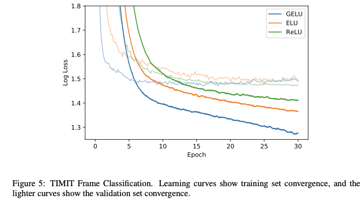

# Gaussian Error Linear Units (GELUs)

- **Title:** Gaussian Error Linear units (GELUs)
- **Authors:** Hendrycks Dan, and Kevin Gimpel.
- **Link to paper**: https://arxiv.org/abs/1606.08415
- **Published to:** arXiv 
- **Year**: 2016

## What & Why

The authors propose a family of activation functions. Their design is inspired by the masking operations done by the ReLU activation [1], and the Dropout[2] and Zoneout[3] regularizers.  Unlike ReLU, these functions:
- are smooth and non-monotonic
- have a negative region
- weight inputs by by their value, instead of gating them by their sign
- have a probablisitc interpretation: they can be seen as the expectation of a stochastic regularizer

These functions are applied element-wise, and among them, figure the GELUs (Gaussian Error Linear Units) and SiLU (Sigmoid Linear Unit) functions. However, the experiments in the paper focus on the GELU function, the authors having observed that SiLU performs worse than GELU (but better than ReLU and ELUs) .

## Details

$$GELU(x) = x\Phi(x)$$$$\ where \ \Phi \ is \ the \ cumulative \ density \ function \ of \ \mathcal{N}(0, 1)$$

The author motivate the choice of the normal distribution by the fact that "neuron inputs tend to follow a normal distribution, especially with Batch Normalization"

SiLU is obatained by using the cumulative density function of the logistic distribution, which is the sigmoid:

$$SiLU(x) = x\sigma(x)$$

  

### GELU as expectation of stochastic regularizers

GELU is the expectation of the following stochastic regularizer:

$$x \mapsto x \odot m, with \ m \sim Bernoulli(\Phi(x))$$

where $\Phi$ is the cumilative density function of $\mathcal{N}(0, 1)$ 

## Results

  

  

  

See more results in the paper.

## References
All images are sourced from the original paper by the authors.

* [1] Nair, V., & Hinton, G. E. (2010). Rectified linear units improve restricted boltzmann machines. In Proceedings of the 27th international conference on machine learning (ICML-10) (pp. 807-814).
* [2] Srivastava, N., Hinton, G., Krizhevsky, A., Sutskever, I., & Salakhutdinov, R. (2014). Dropout: a simple way to prevent neural networks from overfitting. The journal of machine learning research, 15(1), 1929-1958.
* [3] Krueger, D., Maharaj, T., Kramár, J., Pezeshki, M., Ballas, N., Ke, N. R., ... & Pal, C. (2016). Zoneout: Regularizing rnns by randomly preserving hidden activations. arXiv preprint arXiv:1606.01305.
* [4] Ba, J., & Frey, B. (2013). Adaptive dropout for training deep neural networks. Advances in neural information processing systems, 26.