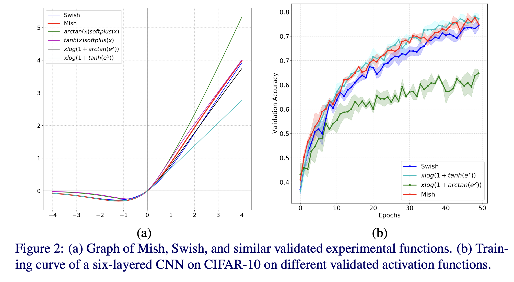
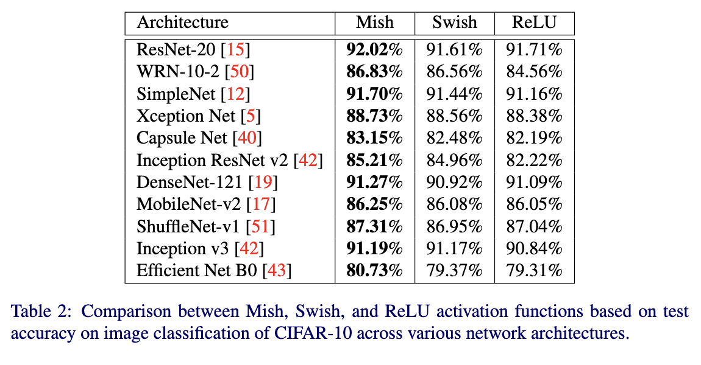
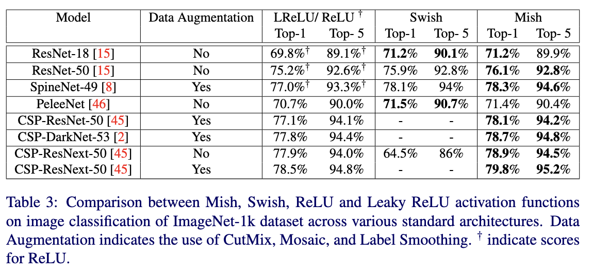

# Mish: A Self Regularized Activation Function

- **Title:** Mish: A Self Regularized Non-Monotonic Activation Function 
- **Author:** Diganta Misra
- **Link to paper:** [arXiv:1908.08681](https://arxiv.org/abs/1908.08681)
- **Published in:** *British Machine Vision Conference (BMVC)*, 2020 (oral presentation; originally on arXiv in 2019)
- **Year:** 2019 (arXiv), 2020 (conference)

## What and Why

This paper introduces Mish, a novel activation function for neural networks. Motivated by the performance of Swish, Mish was discovered through empirical exploration of similar non-monotonic, smooth functions. The author found that Mish consistently outperforms ReLU, Swish, and a number of other experimental activations.

> The Swish activation function, also known as (parametric) Sigmoid Linear Unit (SiLU) was first mentioned in its unparametrized version in the GeLU paper [1] as the expectation of a stochastic regularizer, and was later rediscovered in [2] through neural architecture search techniques. It is non-monotonic, smooth, bounded below, and unbounded above.

## Details

The Mish activation function is given by:

$$Mish(x) = x tanh ( softplus( x ) ) = x tanh( log(1+e^x) )$$

and it's derivative is:

$$Mish'(x) = x \Delta (x) + \frac{Mish(x)}{x}$$$$Where \ \Delta(x) = sech^2(softplus(x))$$

- The author speculates that the $\Delta(x)$ in the derivative "acts like a precoditionner, making the gradient smoother", and improving optimization. 
- To prevent numerical instability (overflow) during training, the softplus function is capped at 20 in practical implementations.

The author also experimented with several similar functions that combined elements like tanh, arctan, and softplus, but they performed poorly or caused unstable training:

- $arctan(x) \cdot \text{softplus}(x)$
- $tanh(x) \cdot \text{softplus}(x)$
- $x \cdot \log(1 + \arctan(e^x))$
- $x \cdot \log(1 + \tanh(e^x))$

  

## Results

The paper evaluates Mish across various tasks and architectures:

### Classification

- On MNIST and CIFAR-10, using vanilla MLPs, Mish:
    - Maintains accuracy better as network depth increases.
    - Demonstrates higher robustness to noise.
- On ImageNet-1K, Mish outperforms both ReLU, PReLU, and Swish across multiple backbone architectures (e.g., ResNet, DenseNet), with and without data augmentation.

  

  

### Object Detection

- On COCO-MS, using detection models like YOLO and RetinaNet, Mish consistently outperforms ReLU/PReLU and Swish in most metrics.

### Computational Considerations

- Vanilla Mish is computationally expensive (2 to 4 times than ReLU).
- The author provides a CUDA-optimized implementation, which achieves similar learning performance to the original version, while reducing computational cost to a level comparable to that of Softplus and ReLU.

## References

All images are sourced from the original paper by the authors.

- [1] Hendrycks, D., & Gimpel, K. (2016). Gaussian error linear units (gelus). arXiv preprint arXiv:1606.08415.
- [2] Ramachandran, P., Zoph, B., & Le, Q. V. (2017). Searching for activation functions. arXiv preprint arXiv:1710.05941.
- [3] Samuel Cortinhas. *Mish: A Self‑Regularized Activation Function* [Notebook]. Kaggle. Retrieved August 31, 2025, from [https://www.kaggle.com/code/samuelcortinhas/mish-a-self-regularized-activation-function-tf/notebook](https://www.kaggle.com/code/samuelcortinhas/mish-a-self-regularized-activation-function-tf/notebook)