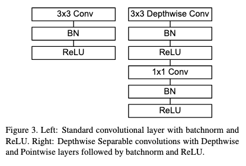
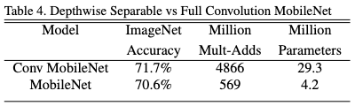
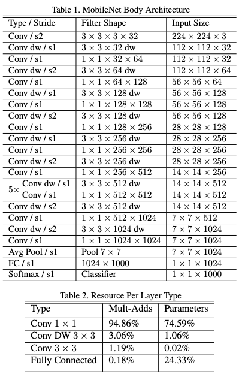
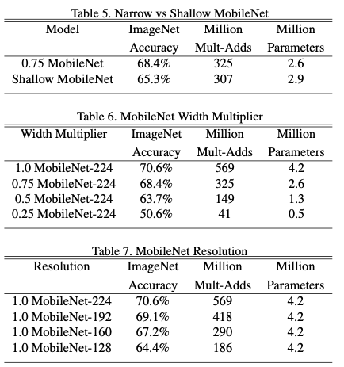
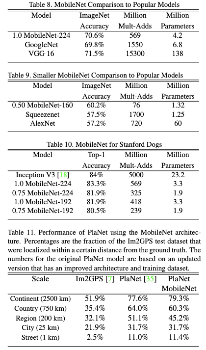
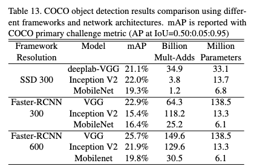

# MobileNets: Efficient Convolutional Neural Networks for Mobile Vision Applications

- **Title:** MobileNets: Efficient Convolutional Neural Networks for Mobile Vision Applications  
- **Authors:** Andrew G. Howard, Menglong Zhu, Bo Chen, Dmitry Kalenichenko, Weijun Wang, Tobias Weyand, Marco Andreetto, Hartwig Adam  
- **Link to paper:** https://arxiv.org/abs/1704.04861  
- **Published to:** arXiv (2017)  
- **Year:** 2017  

## What & Why

This paper introduces *MobileNets*, a family of lightweight CNN architectures designed to achieve strong accuracy with significantly lower computational and memory requirements, making them suitable for deployment on resource-constrained devices. Experimental results show that MobileNets achieve a better accuracy–complexity trade-off than popular architectures such as SqueezeNet, VGG16, AlexNet, and GoogLeNet.

## Details

To reduce computation and memory requirements, MobileNets replace standard convolutions with **depthwise separable convolutions**.

A $D_k \times D_k$ depthwise separable convolution consists of:

1. **Depthwise convolution**: Applies a single $D_k \times D_k$ filter independently to each of the $M$ input channels, performing spatial filtering without mixing channels.
2. **Pointwise convolution** ($1 \times 1$): Linearly combines the $M$ depthwise outputs to produce $N$ output channels.

Compared to a standard convolution (with $D_k^2 M N$ parameters and $H W D_k^2 M N$ FLOPs), a depthwise separable convolution requires only $D_k^2 M + M N$ parameters and $H W (D_k^2 M + M N)$ FLOPs, yielding a reduction of approximately $\tfrac{1}{N} + \tfrac{1}{D_k^2}$ in both computation and model size.

  

In the case of MobileNet, which uses $3 \times 3$ depthwise separable convolutions, this design reduces computation and parameter count by approximately 8–9× compared to standard convolutions, at the cost of only a small reduction in accuracy.

  

### Full Network Architecture

MobileNet variants are derived from a base architecture composed of 28 layers, primarily alternating depthwise and pointwise convolutions:

  

Variants are obtained using two hyperparameters:

- **Width multiplier ($\alpha$):** Scales the number of channels in each layer by a factor $\alpha \in (0, 1]$, allowing a trade-off between accuracy and model size. In depthwise separable convolutions, this reduces the number of parameters and the computational cost by approximately a factor of $\alpha^2$.

- **Resolution multiplier ($\rho$):** Scales the input image resolution by a factor $\rho \in (0, 1]$, reducing the spatial dimensions of feature maps throughout the network. This is done by donwscaling the input image, and decreases the computational cost by approximately a factor of $\rho^2$, at the cost of reduced accuracy.

These hyperparameters allow MobileNets to be easily adapted to different latency and resource constraints.

### Results

#### Comparisons of different MobileNet variants

  

#### Comparisons to popular models

  

  

## References

All images are sourced from the original MobileNet paper by Howard et al. (2017).