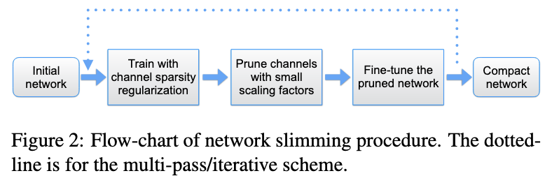
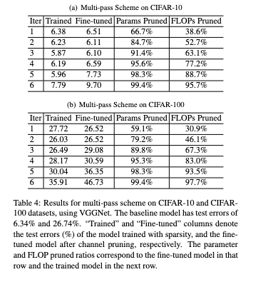

# Learning Efficient Convolutional Networks through Network Slimming

- **Title:** Learning Efficient Convolutional Networks through Network Slimming
- **Authors:** Zhuang Liu, Jianguo Li, Zhiqiang Shen, Gao Huang, Shoumeng Yan, Changshui Zhang; 
- **Link to paper**: https://openaccess.thecvf.com/content_iccv_2017/html/Liu_Learning_Efficient_Convolutional_ICCV_2017_paper.html
- **Published in:** PProceedings of the IEEE International Conference on Computer Vision (ICCV), 2017.
- **Year**: 2017

## What

This paper introduces Network Slimming, a training-time network pruning method that enforces channel-level sparsity via $l_1$ regularization on batch normalization scaling factors. Networks start wide, but during training, insignificant channels are identified and later pruned, yielding thin, efficient models while maintaining accuracy without introducing sparse kernels.

## Why

Many model compression techniques (e.g., unstructured pruning or quantization) rely on custom libraries and/or hardware to realize actual speedups — adding complexity to deployment pipelines.

Network Slimming instead focuses on structured channel pruning, which directly reduces inference time and memory footprint without any special inference engines or toolchains.

## How

1. Train a wide CNN with $l_1$ regularization on the batch normalization scaling factors (γ) for each channel.
2. At convergence, sort channels by the magnitude of γ. Channels with small γ are considered unimportant.
3. Prune a percentage of channels starting with the least important.
4. Fine‑tune the pruned architecture to restore performance.

A multi-pass variant repeats this process iteratively for further reductions. The method works with architectures like VGG, ResNet, and DenseNet, and requires no special accelerators or sparse matrix operations.

  

## Results

  

For more results, see paper, supplemental, and https://github.com/Eric-mingjie/network-slimming.

---

## References

All images are sourced from the original paper by the authors.

- [1] Liu, Z., Li, J., Shen, Z., Huang, G., Yan, S., & Zhang, C. "Learning Efficient Convolutional Networks through Network Slimming." *ICCV*, 2017. ([arxiv.org](https://arxiv.org/abs/1708.06519))  
- [2] Han, S., Mao, H., & Dally, W.J. "Deep Compression: Compressing Deep Neural Networks with Pruning, Trained Quantization, and Huffman Coding." *ICLR*, 2016.
- [3] https://github.com/Eric-mingjie/network-slimming