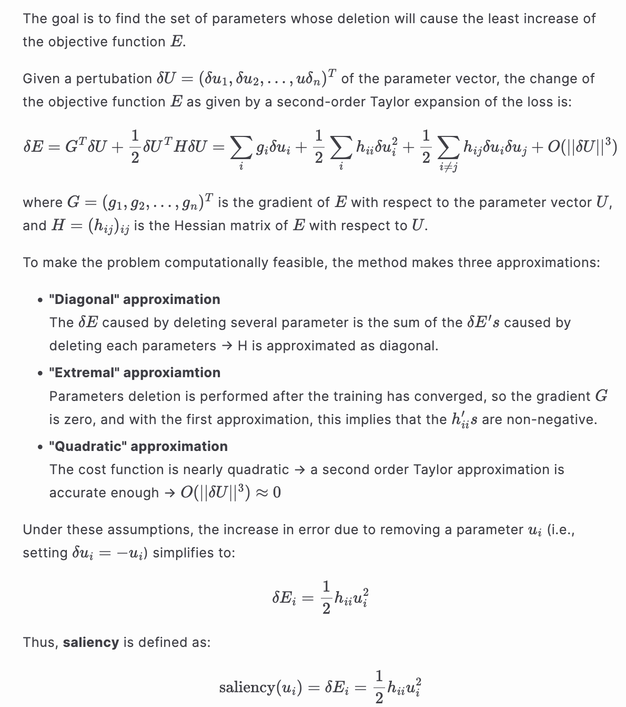
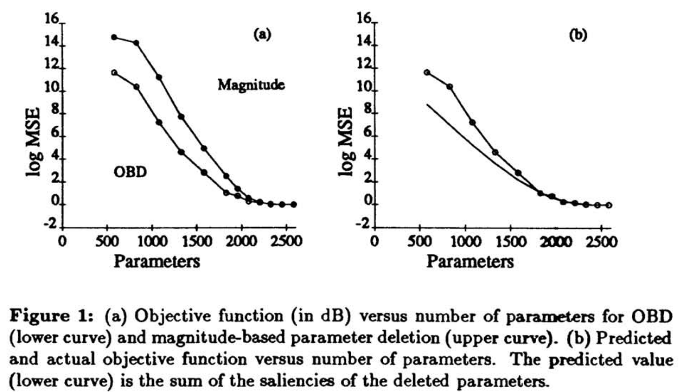
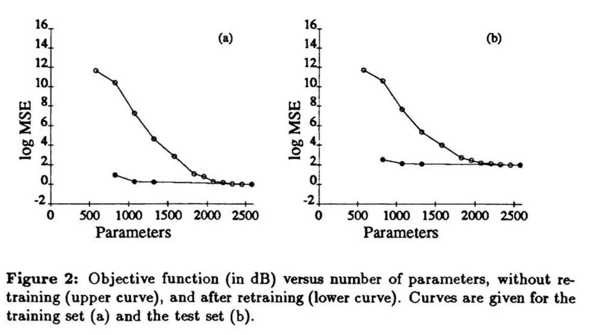

# Optimal Brain Damage

- **Title:** Optimal Brain Damage
- **Authors:** Yann LeCun, John S. Denker, Sara A. Solla
- **Link to paper**: https://proceedings.neurips.cc/paper/1989/hash/6c9882bbac1c7093bd25041881277658-Abstract.html
- **Published in:** Advances in neural information processing systems 2 (1989)
- **Year**: 1989

## What 
The authors introduce a method for pruning neural networks by estimating the importance of each parameter using second-order derivatives of the loss function. This technique leverages a diagonal approximation of the Hessian matrix to identify parameters that can be removed with minimal impact on performance.

## Why
Reducing the number of parameters in a neural network—known as pruning—can improve generalization and make models more efficient. The authors argue that using parameter magnitude as a proxy for importance is naive and propose a more theoretically grounded approach. They define saliency based on the second-order effect of removing a parameter on the loss function.

## Details
Given a trained network, the saliency of a parameter $u_i$ is defined as:

$$\text{saliency}(u_i) = s_i = \frac{1}{2} h_{ii} u_i^2$$

where $h_{ii} = \frac{\partial^2 E}{\partial u_i^2}$ is the diagonal element of the Hessian matrix of the loss function $E$ with respect to the parameter vector $U = (u_1, u_2, \dots, u_n)^T$.

Derivation of the saliency measure

<a href="./details.md">Link to Markdown version</a>

  

---

Using this saliency measure the pruning process consists of the following steps:

1. Choose a network architecture
2. Train the network
3. Compute the second derivative $h_{ii}$ for each parameter
4. Compute the saliency $s_i = h_{ii} u_i^2/2$ for each parameter
5. Delete some low-saliency parameters
6. Repeat from step 2

## Results
Results obtained using back-propagation applied to handwritten recognition.

  

  

## References

All images are sourced from the original paper by the authors.