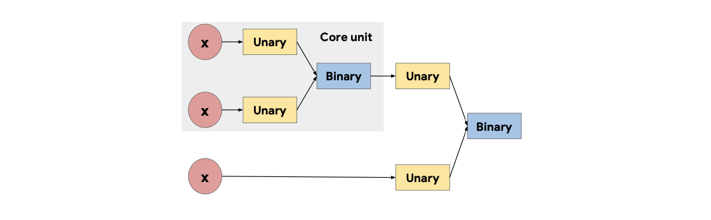
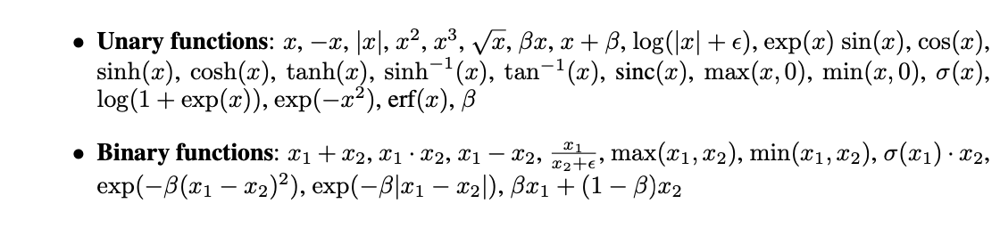
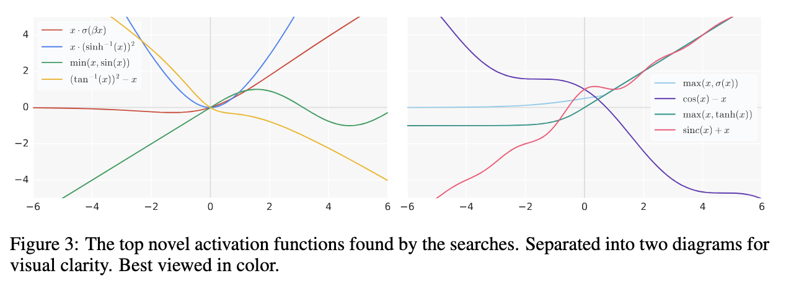
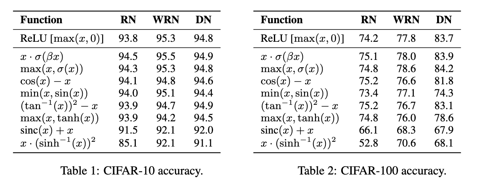
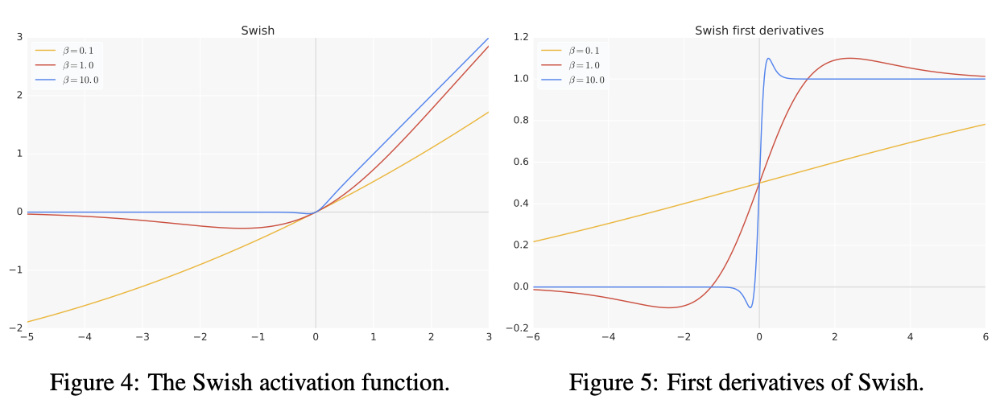
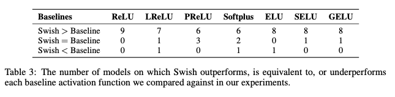
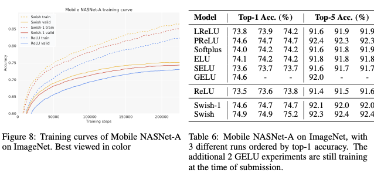
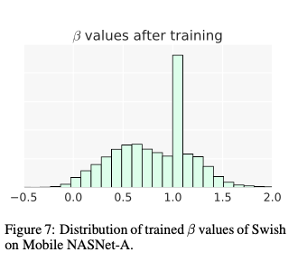
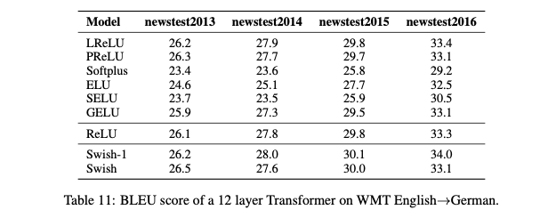

# Searching for Activation Functions

- **Title:** Searching for Activation Functions
- **Authors:** Ramachandran Prajit, Barret Zoph, and Quoc V. Le.
- **Link to paper**: https://arxiv.org/abs/1710.05941
- **Published to:** arXiv 
- **Year**: 2017

## What & Why

The authors explored the use of Neural Architecture Search (NAS) techniques to discover novel activation functions. This is motivated by:

- The effectiveness of, at the time recently proposed, Neural Architecture Search (NAS) methods for automatically finding *good* neural network architectures  
- The inconsistency in performance across models and datasets of hand-crafted activation functions proposed to replace the default ReLU function

They called **"Swish"** the most performant activation function found during the search phase. Interestingly, it is a parametrized version of the **SiLU (Sigmoid Linear Unit)** activation function [1, 2]:

$$Swish_{\beta}(x) = x\sigma(\beta x)$$$$SiLU(x) = Swish_{1}(x) = x\sigma(x)$$

After the search phase, they experimentally validated the effectiveness and consistency of **"Swish"** on different tasks for different architectures.

## Details

### Search Space

The search space is limited to element-wise activation functions consisting of a limited composition of unary and binary functions acording to the diagram in the image below

  

  

where $\beta$ is a per-channel trainable parameter and $\sigma$ is the sigmoid function.

### Search Algorithm

For searching in large spaces, they used the RL-based method proposed by Zolph & Le in [3]. it consists of a RNN-controler that, at each step, autoregessivelly produces batches of token sequences each representing activation functions from the search space.

For each generated activation function, a small network (ResNet-20) using that activation is trained on CIFAR-10 and its validation accuracy is used as *signal* to update the RNN-controller using Proximal Policy Optimization (PPO).

## Results

### Top performing activation function

  

* **RN**: ResNet-164
* **WRN**: Wide ResNet
* **DN**: DenseNet

  

### More on Swish

Swish *can be viewed* as a smooth function that non-linearly interpolates between the linear and ReLU functions:
* When $\beta = 0$, Swish is the linear funcion $x \mapsto x/2$
* As $\beta \rightarrow \infty$, Swish becomes like the ReLU function

  

When $\beta=1$, Swish is the SILU activation function [1, 2]

Swish has been benchmarked against ReLU and others activation functions on CIFAR and imagenet classification, and English->German translation.

  

  

  

  

On all the experiments, the performance of Swish-1 (SiLU) is on par with that of Swish (where $\beta$ is trained)

See paper for more results.

## References
All images are sourced from the original paper by the authors.

* [1] Hendrycks, D., & Gimpel, K. (2016). Gaussian error linear units (gelus). arXiv preprint arXiv:1606.08415.
* [2] Elfwing, S., Uchibe, E., & Doya, K. (2018). Sigmoid-weighted linear units for neural network function approximation in reinforcement learning. Neural networks, 107, 3-11.
* [3] Zoph, B., & Le, Q. V. (2016). Neural architecture search with reinforcement learning. arXiv preprint arXiv:1611.01578.