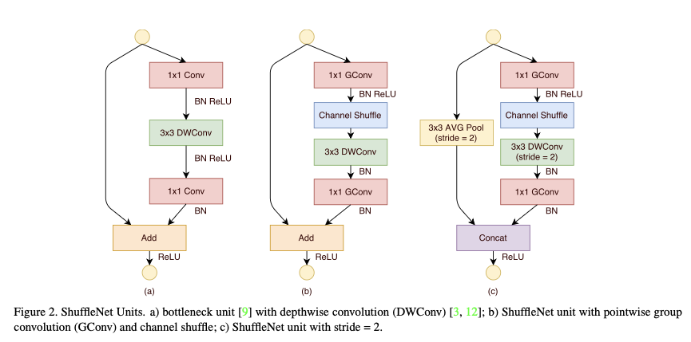
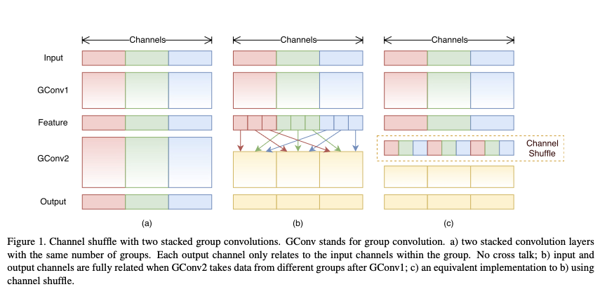
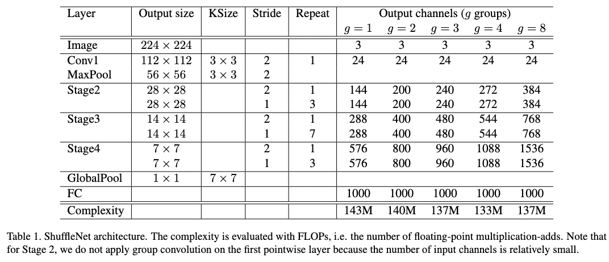
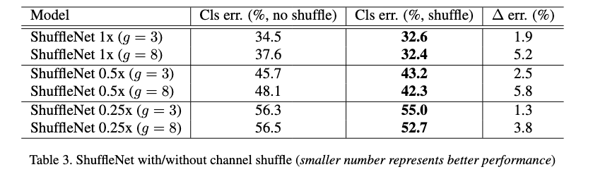
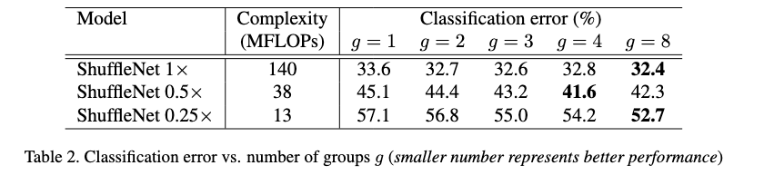
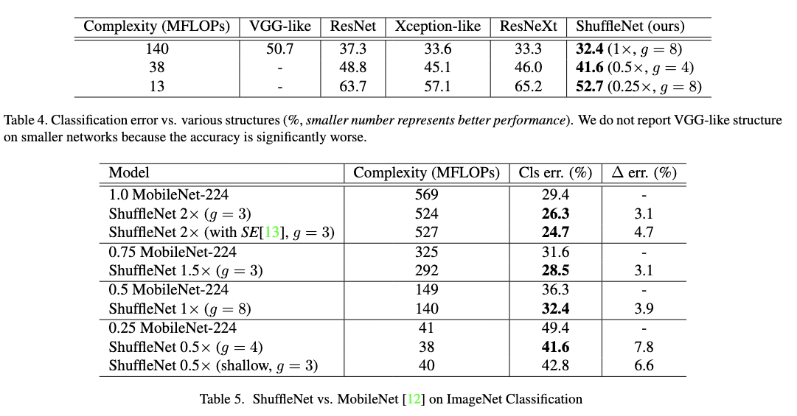
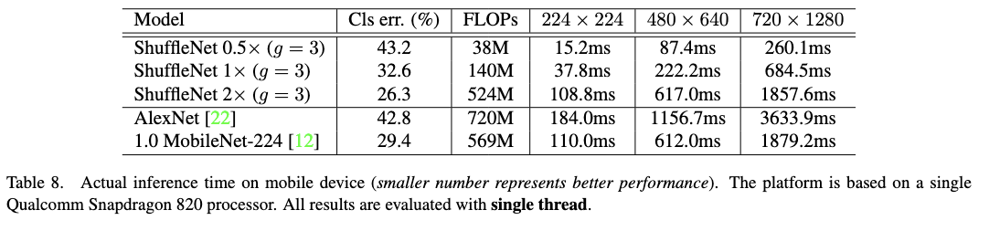

# ShuffleNet: An Extremely Efficient Convolutional Neural Network for Mobile Devices

- **Title:** ShuffleNet: An Extremely Efficient Convolutional Neural Network for Mobile Devices  
- **Authors:** Xiangyu Zhang, Xinyu Zhou, Mengxiao Lin, Jian Sun  
- **Link to paper:** https://arxiv.org/abs/1707.01083  
- **Published in:** arXiv (2017); CVPR 2018  
- **Year:** 2017  

## What & Why

- Introduces **ShuffleNet**, a family of CNN architectures designed for **extreme computational efficiency**, targeting budgets as low as **10–150 MFLOPs**.
- Prior efficient models such as **MobileNets** reduce computation using depthwise separable convolutions, but most of the remaining cost lies in the **$1 \times 1$ pointwise convolutions**.
- ShuffleNet further improves efficiency by **reducing the cost of pointwise convolutions** using grouped convolutions and a novel channel shuffle operation, achieving a better accuracy–efficiency trade-off than simply shrinking network width or depth.

## Details

ShuffleNet is built from repeated **ShuffleNet units**, which are inspired by bottleneck residual blocks with depthwise separable convolutions.

- Each unit follows a **pointwise → depthwise → pointwise** structure.
- The architecture can be augmented with **Squeeze-and-Excitation (SE) units** to further improve accuracy.

    

### Grouped Pointwise Convolutions

To reduce computational cost, ShuffleNet replaces standard $1 \times 1$ convolutions with **grouped pointwise convolutions**.

- Input and output channels are split into $g$ groups.
- Convolutions are applied independently within each group, reducing the number of connections.

For an input of size $c \times h \times w$ and a ShuffleNet unit with a $3 \times 3$ depthwise convolution and a bottleneck of $m$ channels, the computational cost is reduced from $hw(2cm + 9m^2)$  to $hw\left(\frac{2cm}{g} + 9m^2\right)$

While this significantly lowers FLOPs, grouped convolutions restrict information flow across channel groups.

### Channel Shuffle Operation

To address the limited cross-group communication, ShuffleNet introduces a **channel shuffle** operation:

- Channels are reshaped, permuted, and reassigned across groups.
- For a feature map with $ng$ channels, the tensor is reshaped to $n \times g$ channels, transposed, and flattened back (performed along the channel dimension).
- This enables information exchange between groups in subsequent layers.

The shuffle operation has **negligible computational cost** but is essential for preserving accuracy.

    

### Full Network Architecture

ShuffleNet variants are derived from a common base architecture:

    

- Model variants are obtained by scaling the number of channels with a **width multiplier** $s$.
- For spatial downsampling:
  - The depthwise convolution in the ShuffleNet unit uses a stride of 2.
  - An average pooling with stride 2 is applied on the shortcut path.
  - Outputs are concatenated, **doubling the number of channels** while halving the spatial resolution.

## Results

Experiments on ImageNet demonstrate that:

- ShuffleNet significantly outperforms MobileNet under **very tight computational budgets** (e.g., <150 MFLOPs).
- The channel shuffle operation is critical; removing it leads to a noticeable drop in accuracy.
- ShuffleNet achieves a superior **accuracy–computation trade-off** compared to previous lightweight CNNs.
- Adding **Squeeze-and-Excitation (SE) units** further improves accuracy at a modest computational cost.

    

    

    

    

More results can be found on the paper.

## References
All images are sourced from the original paper ShuffleNet paper by Zhang et al.

- [1] Howard et al., MobileNets: Efficient Convolutional Neural Networks for Mobile Vision Applications, arXiv:1704.04861
- [2] Hu et al., Squeeze-and-Excitation Networks, CVPR 2018