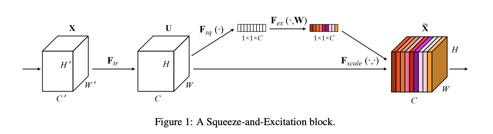
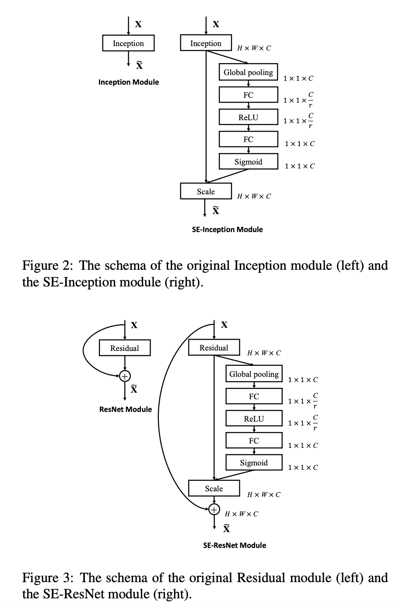
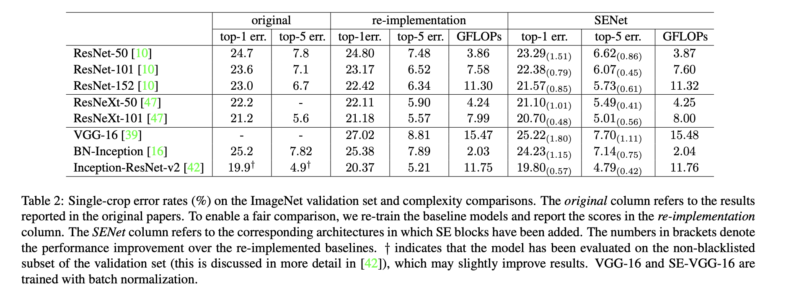
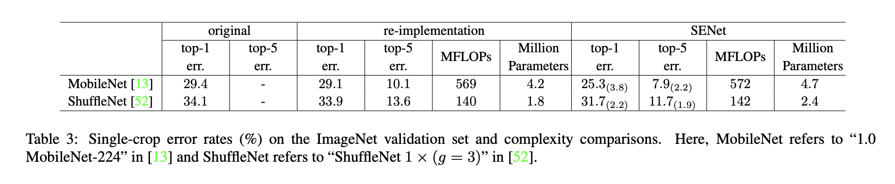
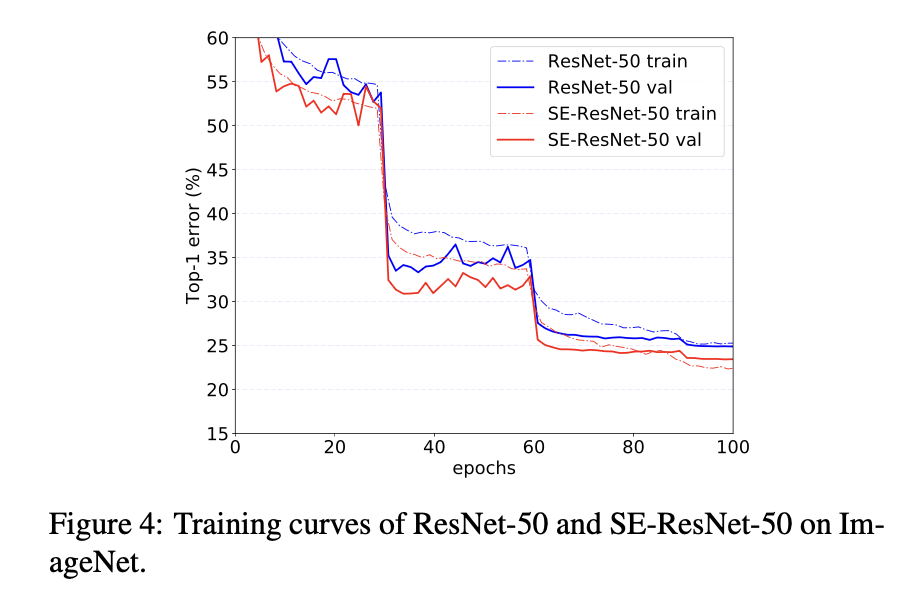

# Squeeze-and-Excitation Networks

- **Title:** Squeeze-and-Excitation Networks  
- **Authors:** Jie Hu, Li Shen, Samuel Albanie, Gang Sun, Enhua Wu
- **Link to paper:** https://arxiv.org/abs/1709.01507  
- **Published in:** arXiv (2017); CVPR 2018  
- **Year:** 2017 (arXiv preprint), 2018 (CVPR)

## What & Why

- Introduces **Squeeze-and-Excitation (SE) Networks**, a **lightweight** architectural module designed to improve the representational power of CNNs by explicitly modeling **channel-wise dependencies**.
- SE blocks adaptively **recalibrate/scale channel responses**, leading to consistent accuracy improvements across many CNN architectures.
- SE modules add minimal computational overhead and can be easily integrated into existing networks such as ResNet, Inception, MobileNet, and ShuffleNet.

## Details

An SE block can be inserted into a standard convolutional block and works by scaling its output convolutional feature map using weights derived from the feature map channel statistics.

This is done in three main steps: **Squeeze**, **Excitation**, and **Scale**.

  

### Squeeze: Global Information Embedding

- Each channel is *summarized* using a **squeeze operation** (a simple global average pooling in the paper).
- This produces a channel descriptor that captures global spatial information.

For an input feature map of size $C \times H \times W$, the squeeze operation produces a vector of size $C$:

$x_c = \frac{1}{HW} \sum_{i=1}^{H} \sum_{j=1}^{W} X_c(i,j)$

### Excitation: Adaptive Channel Recalibration

- The channel descriptor is passed through an **excitation network**: a small bottlenecked tow-layer fully connected network.
- A reduction ratio $r$ is used to limit complexity.

The excitation operation is defined as:

$$s = \sigma\left(W_2 \, \text{ReLU}(W_1 x)\right)$$

where:
- $W_1 \in \mathbb{R}^{\frac{C}{r} \times C}$
- $W_2 \in \mathbb{R}^{C \times \frac{C}{r}}$
- $\sigma$ is sigmoid

### Scale: Feature Reweighting

- The weights at the output of  the excitation network are used to rescale the original feature maps via channel-wise multiplication: $\tilde{X}_c = s_c \cdot X_c$

- Intuitively, channels deemed more informative are amplified, while less useful channels are suppressed.

  

### Computational Overhead

- **Additional parameters per SE block:** $\frac{2C^2}{r}$
- **Additional FLOPs:** negligible compared to convolutional layers
- Common choice: $r = 16$
- For example, with ResNet50
    - 3.86 GFLOPs (without SE) VS 3.87 GFLOPs (with SE)
    - ~2.5 millions additional parameters from the SE Blocks VS ~25 millions parameters of the vanilla ResNet50
    - Reported inference time (paper setting): 190 ms → 209 ms on 8× NVIDIA Titan X GPUs

---

## Results

- SE blocks consistently improve top-1 and top-5 accuracy across a wide range of architectures.
- It is also effective in lightweight models, improving accuracy without significantly increasing computation.

  

  

- Training details:
    - For ImageNet experiments, SGD with momentum was used, with the learning rate decayed by a factor of 10 every 30 epochs.

    

## References

All images are sourced from the original Squeeze-and-Excitation Networks paper by Hu et al. (2017).