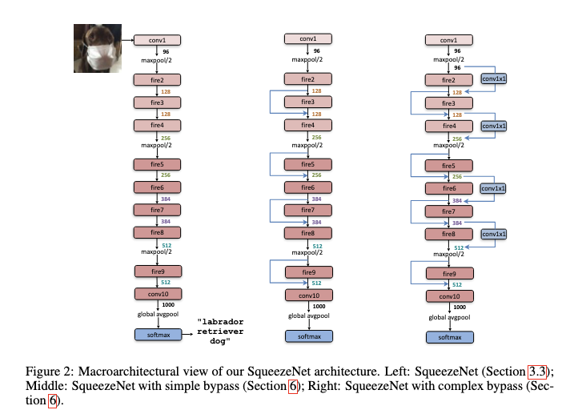
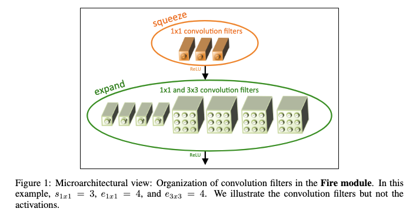
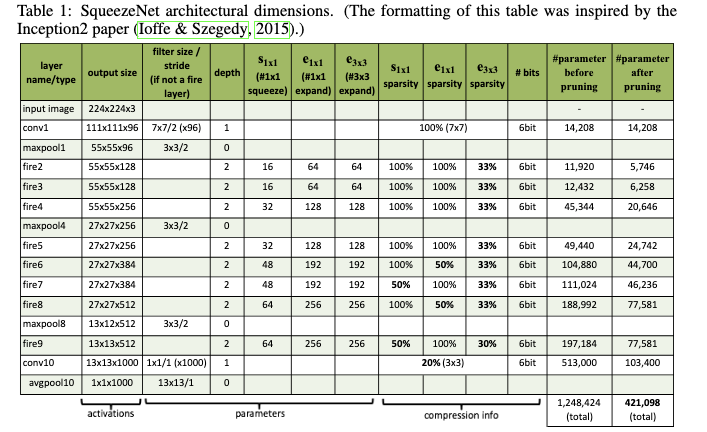
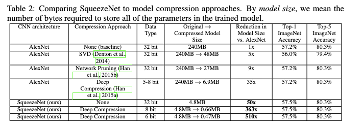
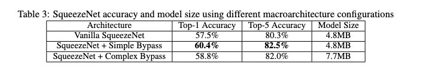

# SqueezeNet: AlexNet-level accuracy with 50x fewer parameters and <0.5MB model size

- **Title:** SqueezeNet: AlexNet-level accuracy with 50x fewer parameters and <0.5MB model size  
- **Authors:** Forrest N. Iandola, Song Han, Matthew W. Moskewicz, Khalid Ashraf, William J. Dally, Kurt Keutzer  
- **Link to paper:** https://arxiv.org/abs/1602.07360  
- **Published to:** arXiv (2016)
- **Year:** 2016  

## What & Why

The authors introduce SqueezeNet, a CNN architecture that achieves AlexNet-level accuracy on ImageNet while using 50× fewer parameters. This drastic reduction lowers bandwidth requirements when transmitting model parameters, enabling more efficient distributed training and reducing deployment overhead when exporting models to clients. Additionally, it enables deployment on devices with very limited memory.

The authors also demonstrate that SqueezeNet is compatible with the *Deep Compression* technique [1], which further reduces model size by up to 10× without loss in accuracy on ImageNet.

## Details

SqueezeNet is primarily composed of repeated instances of a basic building block called the *Fire module*. The network stacks multiple Fire modules, and a few max-pooling layers for spatial downsampling. At the end of the network, a global average pooling layer is applied, followed by a softmax activation for classification.

To maintain accuracy, the authors suggest delaying downsampling until later stages of the network. They also explore the use of residual (bypass) connections as an optional extension to improve performance.

  

To reduce the total number of parameters, the Fire module is designed as a two-layer block based on the following principles:

#### Replace some 3×3 filters with 1×1 filters

- Within the same layer, 1×1 and 3×3 convolutions are applied in parallel.
- Their outputs are concatenated along the channel dimension.
- This layer forms the second stage of the Fire module and is referred to as the *expand layer*.

#### Reduce the number of input channels to the expand layer using 1×1 convolutions

- A preceding convolutional layer with only 1×1 filters limits the number of input channels.
- This layer is called the *squeeze layer*.
- Since the number of parameters in a convolutional layer is proportional to its number of input channels, the squeeze layer significantly reduces the parameter count of the subsequent expand layer.

  

where:
- $s_{1×1}$ is the number of 1×1 filters in the *squeeze layer*
- $e_{1×1}$ and $e_{3×3}$ are respectively the numbers of 1×1 and 3×3 filters in the *expand layer*

  

### Results

Experiments on ImageNet show that:
- SqueezeNet matches AlexNet-level accuracy with approximately 50× fewer parameters.
- When combined with model compression techniques such as pruning and quantization, the final model size can be reduced to less than 0.5 MB without loss of accuracy.

  

  

## References
All images are sourced from the original SqueezeNet paper by Iandola et al. (2016).

- [1] Han, Song, Huizi Mao, and William J. Dally. "Deep compression: Compressing deep neural networks with pruning, trained quantization and huffman coding." arXiv preprint arXiv:1510.00149 (2015).