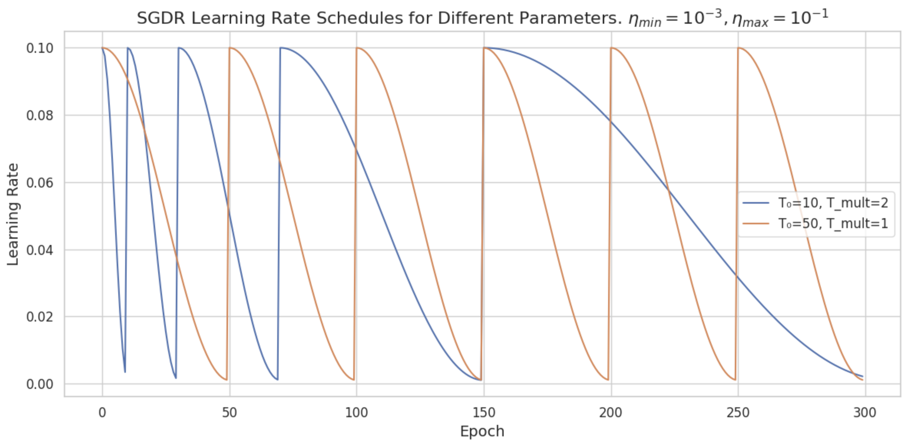
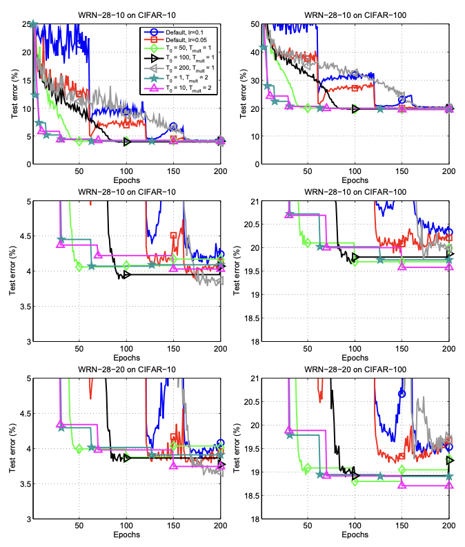
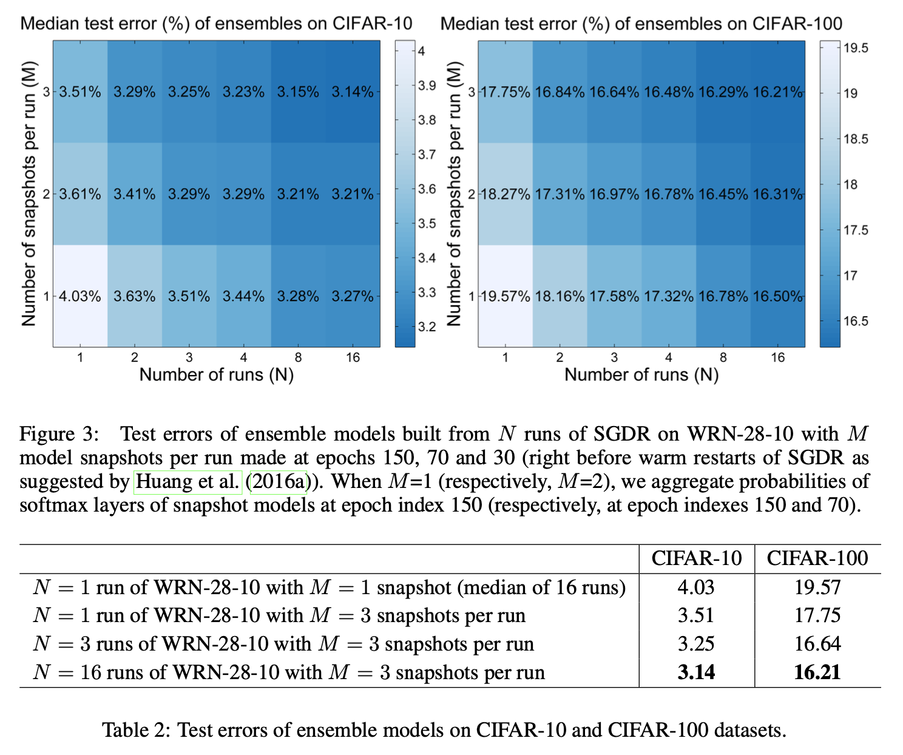

# SGDR: Stochastic Gradient Descent With Restarts

- **Title:** SGDR: Stochastic Gradient Descent With Restarts
- **Authors:** Ilya Loshchilov and Frank Hutter
- **Link to paper**: https://arxiv.org/abs/1608.03983
- **Published to:** arXiv (August 2016); Conference: ICLR 2017
- **Year**: 2016

## What & Why

The authors propose SGDR, a warm restart technique for SGD (stochastic gradient descent) that periodically "restarts" the learning rate schedule. It is inspired by restart techniques used in gradient-free and accelerated optimization methods, which help mitigate issues like ill-conditioning and improve convergence speed.

SGDR improves the anytime performance of SGD—producing better solutions even if training is interrupted early. Additionally, combining the models obtained before each restart into an ensemble can yield significant performance gains without requiring any additional training cost [1].

## Details

SGDR modifies the learning rate schedule by employing cosine annealing with periodic restarts. The learning rate at time step $t$ is defined as:

$$\eta_t = \eta_{\min} + \frac{1}{2} (\eta_{\max} - \eta_{\min}) \left(1 + \cos\left(\frac{T_{cur}}{T_i} \pi\right)\right)$$

- $\eta_{\min}$: minimum learning rate  
- $\eta_{\max}$: maximum (initial) learning rate  
- $T_{cur}$: number of epochs since the last restart  
- $T_i$: number of epochs between restarts $i$ and $i+1$

At the beginning of the cycle $i$, $T_{cur} = 0$  and the learning rate is $\eta_{max}$. The learning rate then decreases at each step until the end of the cycle when $T_{cur}=T_i$ and the learning rate is $\eta_{min}$. The next step corresponds to the beginning of the cycle $i+1$, $T_{cur}$ is reset to 0 and $T_i$ replaced by $T_{i+1}.$ 

$T_i$ can be increased after each restart to allow more "refinements" as training progresses. The authors propose to increase it by a constant factor $T_{mult}$ after each restart:

$$T_i = T_{mult} \ T_{i-1}$$

The authors also suggest decreasing $\eta_{\min}$ and $\eta_{\max}$  after each restart but didn't explore this strategy for simplicity.

  

## Results

### Results on CIFAR-10 and CIFAR-100

- Network used: WRN (Wide ResNet)
    - WRN-d-k: Wide ResNet of depth d and width k (k times more filters per channel than used in the original Residual Neural Networks)
- Baseline learning-rate scheduler:
    > "learning rate is dropped by a factor of 0.2 at 60, 120 and 160 epochs, with a total budget of 200 epochs."
- Optimizer: SGD with Nesterov's momentum 

  

    
### Snapshot Ensembling
When snapshots of the model (before each restart) are ensembled, SGDR outperforms traditional ensembles with much less computational cost.

  

**See paper for more results on ImageNet and EEG recordings**

## References
All images of the Results section are sourced from the original paper by the authors.

- [1] Huang, G., Li, Y., Pleiss, G., Liu, Z., Hopcroft, J. E., & Weinberger, K. Q. (2017). Snapshot ensembles: Train 1, get m for free. arXiv preprint arXiv:1704.00109.