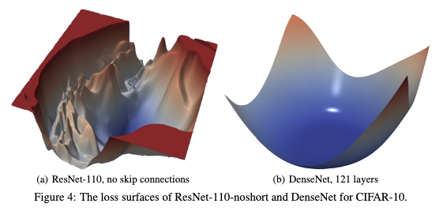
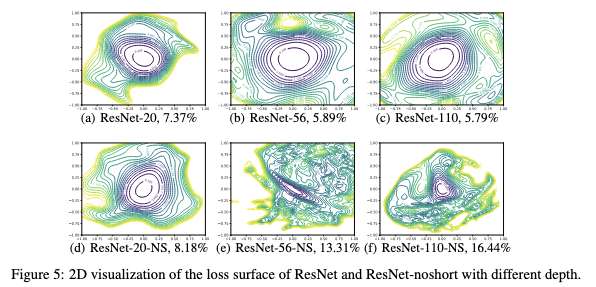
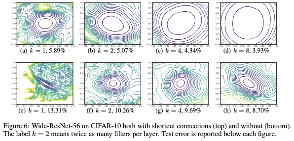
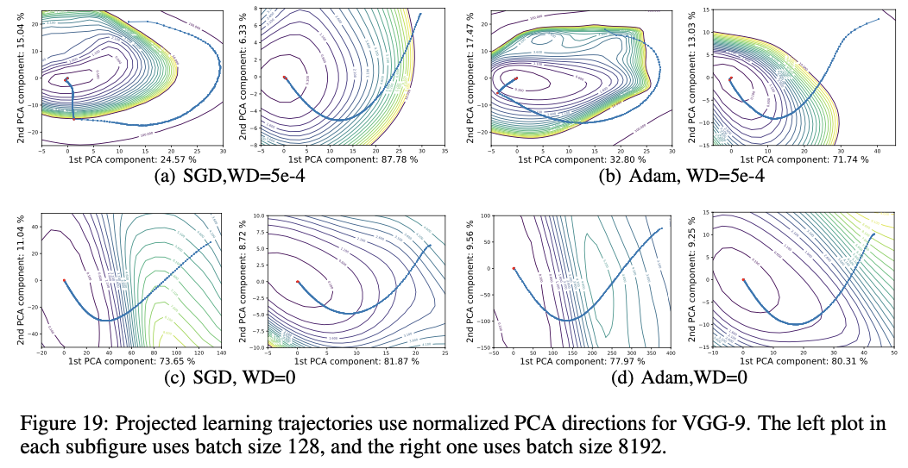

# Visualizing the Loss Landscape of Neural Nets

- **Title:** Visualizing the Loss Landscape of Neural Nets
- **Authors:** Li H., Xu Z., Taylor G., Studer C., & Goldstein T. 
- **Link to paper**: https://proceedings.neurips.cc/paper/2018/hash/a41b3bb3e6b050b6c9067c67f663b915-Abstract.html
- **Published in:** aAdvances in Neural Information Processing Systems (NeurIPS), Volume 31, 2018.
- **Year**: 2018

## What

The authors of this paper highlight a limitation in earlier methods for vizualizing the loss landscape of neural networks and introduce a technique to address it.

Their proposed method leads to visualizations that are more consistent with our intuitive understanding of why modern deep learning techniques result in models that are easier to train and that generalize well. 

The authors also provide, through their experiments, valuable insights into the relationship between optimization, architecture choices, and generalization performance.

## Why

- *Accurate* visualizations of neural networks loss landscape can give insights into the effects of different design choices. In particular, they can help explain why certain neural networks train well and generalize better than others.
- Previous methods produce visualizations that can be misleading, especially when comparing two different minimizers or two different networks, due to scale invariance in some network weights.
- There was a need for a visualization technique that would reflect more the true structure of the loss surface.

## Details

Let's $L:\theta \mapsto L(\theta)$, the loss function computed on all the training data. The authors consider the following baselines:

**1-Dimensional Linear Interpolation** $\;$ choose two parameter vectors $\theta_1$ and $\theta_2$, and plot the values of the loss function along the line connecting them: 
$$L(\ \alpha \theta_1 + (1-\alpha) \theta_2 \ ), \  with \ \alpha \in [0, 1]$$

**Countour Plot and random Directions** $\;$ choose a center point $\theta^*$ in the graph, and choose two random directions $\delta$ and $\eta$. Then, plot functions of the form:
- $\alpha \mapsto L(\theta^* + \alpha \eta)$, in the 1D case;
- $\alpha, \beta \mapsto L(\theta^* + \alpha \eta + \beta \delta)$, in the 2D case.

### Filter-Wise Normalization

One problem in directly applying the above two methods is that two equivalent networks ( i.e. $net_1(x) = net_2(x) \ \forall x$ ) can lead to different visualisations (because symmetries in networks is not taken into accout), making comparisons impossible and interpretation hard.

For example, consider the following subnetwork: conv1->relu->conv2. If you multiply the weights of conv1 by a positive factor and divide those of conv2 except the bias by the same factor, you get an equivalent subnetwork. However, these two subnetworks have different sensitivities to the same weights perturbation. This is more pronounced when using normalization layers, where networks with large weights may appear more stable to perturbations than their equivalents with smaller weights.

The authors propose **filter-wise normalization**, a technique to remove this scaling effect. It consists of normalizing each filter of the directions $\eta$ and/or $\delta$ such that their norm is equal to the one of their corresponding network filters. That is, for a direction $d$:

$$||d_{i, j}|| = ||\theta_{i, j}||$$

where $\theta_{i, j}$ is the $j$-th filter in the $i$-th layer.

This is can be done by first choosing/sampling $d$, then normalizing it: $$d_{i, j} \leftarrow \frac{d_{i, j}}{||d_{i, j}||} ||\theta_{i, j}||$$

## Results

The authors conducted many experiments with several interesting results, including:

- Generalization correlates better with flat minima in visualizations obtained using filter-wise normalization, compared to those produced without it.
- When comparing the evolution of the norm of networks trained with different batch sizes, it is important to do the comparison with respect to optimization steps, not just epochs. This is because small-batch training performs more frequent updates per epoch, effectively applying stronger regularization.
- Visualizations on ResNet and Wide-ResNet trained on CIFAR-10 reveal several insights, some of which are summarized below.

**1 - Shortcut/skip connections "prevent the explosion of non-convexity that occurs when networks get deep"**

- Deep plain networks exhibit increasingly chaotic and sharp landscapes.
- Adding skip connections (as in ResNets) smooths the loss surface, resulting in more trainable and generalizable models.

  

  

   
**2 - Increased network width prevents chaotic behavior and skip connections dramatically widen minimizers**

- Skip connections, in combination with width, lead to very broad basins of low loss.

  

**3 - Optimization trajectories lie in extremely low dimensional space**

- Although training occurs in a very high-dimensional parameter space, the path that SGD takes lies within a low-dimensional manifold.
- This was demonstrated by applying Principal Component Analysis (PCA) to the sequence of weight updates (i.e., to the differences between successive weight vectors during training).
- The first few principal components capture the vast majority of the variance, suggesting that SGD explores only a very small subspace of the full parameter space.
- "This low dimensionality can be explained by the presence of large, nearly convex regions in the loss landscape"

  

---
- A 2D contour plot of ResNet-56, even at a relatively low resolution of 51 x 51, takes about 1 hour to compute on a workstation with 4 GPUs (Titan X Pascal or 1080 Ti).
- The paper and its supplementary material contain many additional interesting results

## References

All images of the Results section are sourced from the original paper by the authors.